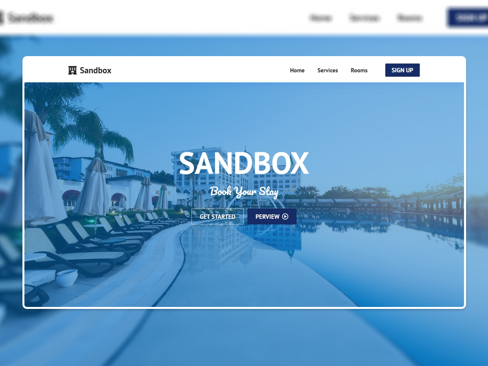

# React-Website-TRVL

This is my first React project. It's a responsive travel website with a clean design.

## Stack
- [React.js](https://reactjs.org/) - A JavaScript library for building user interfaces.
- [CSS](https://www.w3schools.com/css/) - A language used to style an HTML document. 

## Features
- `React Router` - using Router to render web pages and components after clicking the Link tag without reloading the website.
- `useState & useEffect` - create toggle animation for a responsive navbar 
- `Reusable components` - Button & CardItem components are reusable by passing the Propt to change style or content inside elements.

## Design

